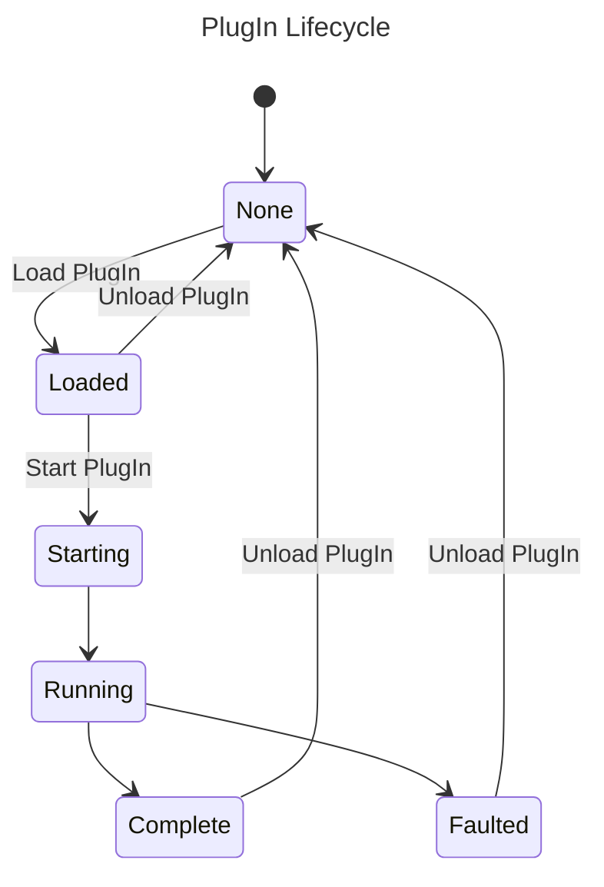

# Shos

## PlugIn LifeCycle States

```mermaid
---
title: PlugIn Lifecycle
---
stateDiagram-v2
    [*] --> None
    None --> Loaded : Load PlugIn
    Loaded --> Starting : Start PlugIn
    Loaded --> None : Unload PlugIn
    Starting --> Running
    Running --> Complete
    Running --> Faulted
    Complete --> None: Unload PlugIn
    Faulted --> None: Unload PlugIn
```
